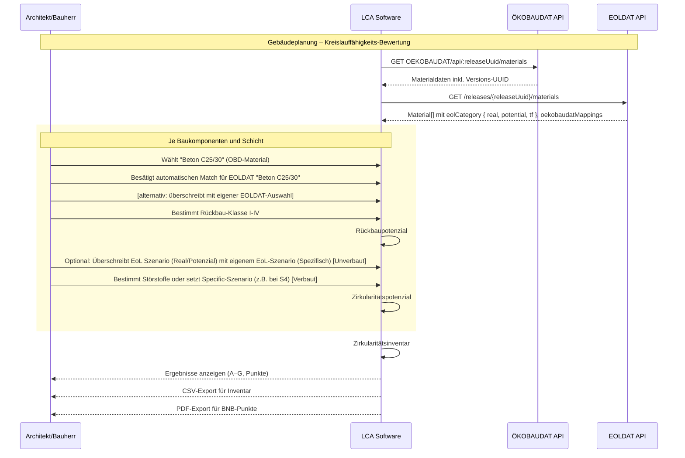

# BNB Zirkularitätsindikatoren – Software-Implementierungsleitfaden

## Einleitung

### Ziel und Zielgruppe

Diese Dokumentation richtet sich an **LCA-Softwareanbieter**, die die BNB Zirkularitätsindikatoren in ihre Software integrieren möchten.

**Wichtiger Hinweis:** Diese Dokumentation ist ein **Implementierungsleitfaden für Software-Entwickler** und ersetzt nicht die offizielle Methodik. Die **BNB-Steckbrief U.05 "Kreislauffähigkeit"** ist die **einzige verbindliche Quelle** für die Bewertungsmethodik, Begriffe, Berechnungsformeln und Bewertungskriterien. Dieser Leitfaden soll die technische Umsetzung in LCA-Software erleichtern. Der BNB-Steckbrief U.05 „Kreislauffähigkeit“ wird Anfang 2026 öffentlich verfügbar sein.

Die BNB Zirkularitätsindikatoren sind eine **Erweiterung der LCA-Software**, die es ermöglicht, die Kreislauffähigkeit von Gebäuden gemäß dem **BNB-Steckbrief U.05 "Kreislauffähigkeit"** zu berechnen.

Diese Implementierungsdokumentation ergänzt den BNB-Steckbrief U.05 und geht dabei insbesondere ein auf:

- den technischen Kontext, insbesondere die existierende ÖKOBAUDAT-API/Datenquelle
- die neu entwickelte EOLDAT-API, welche vorhandenen Materialien aus ÖKOBAUDAT zusätzliche End-of-Life-Szenarien (EoL) zuordnet und damit die Berechnung des Zirkularitätspotenzials ermöglicht
- **technische Implementierungshinweise** für die in BNB-Steckbrief U.05 definierte Berechnungsmethodik

### Kontext (BNB U.05, DIN 276, EN ISO 14040/44)

- Was: Verbindliche Standards, Begriffe und Bewertungsgrenzen (definiert im BNB-Steckbrief U.05).
- Warum: Compliance sicherstellen und gemeinsame Sprache nutzen.

### Systemgrenzen & Scope (KG 300, Cut-off-Regeln)

Der BNB-Steckbrief U.05 grenzt den Bewertungsumfang klar ab: Nur die Baukonstruktion des Bauwerks (KG 300) wird bewertet. Gebäudetechnik (KG 400) und Außenanlagen gehören derzeit nicht zum Scope. Zusätzlich regeln Cut‑off‑Prinzipien, welche Bauteil-Schichten oder Baukomponenten erfasst werden müssen.

#### Begriffe (kurz erklärt)

- KG (Kostengruppe) nach DIN 276: Standard zur Kostengliederung im Bauwesen; „KG 300“ = Baukonstruktion, „KG 400“ = Technische Gebäudeausrüstung.
- Cut‑off: Räumliche Erfassungsgrenze: es werden nur jene Baumaterialien erfasst, die für die Bewertung relevant sind.
- Trennbare Materialschichten: Schichten, die im Rückbau gezielt getrennt und ggf. ohne Störstoffe rückgewonnen werden können.
- Von Unverbaut zu Verbaut:
  - EoL unverbaut = Materialbewertung im Ausgangszustand ab Werk auf Basis von Real/Potenzial + Technologiefaktor(TF) → Total
  - EoL verbaut = projektspezifisches Zirkulariätspotenzial im eingebauten Zustand, basierend auf Unverbaut‑Punkten und wird durch Störstoffklassen (S1–S3 Abzüge; S4 mit Specific‑Szenario) angepasst (Details in Abschnitt Zirkularitätspotenzial).
- EoL‑Szenario vs. EoL‑Kategorie:
  - EoL‑Szenario = codierter Verwertungs- oder Beseitigungsweg (z. B. WV, CL+, RC−) → diesem sind Punkte oder eine Klasse (A-G) zugeordnet
  - EoL‑Kategorie = EOLDAT‑Datenobjekt für Unverbaut mit {real, potential, technologyFactor}, das die Referenzszenarien und tf bündelt (Details in Abschnitt Zirkularitätspotenzial).
- Technologiefaktor (tf): Gewicht 0.0–1.0 zur Mischung von Real und Potenzial im Unverbaut‑Pfad → Total. Mehr dazu in Abschnitt Zirkularitätspotenzial.
- EoL‑Punkte und EoL‑Klasse: EoL Punkte des unverbauten Materials werden aus der Formel für die Gewichtung zwischen realen und zukünftig erwartbaren EoL Szenarien abgeleitet; Klassen (A–G) aus Punkteschwellen. Mehr dazu im Abschnitt Referenztabellen.
- Störstoffklassen (S0–S4): materialabhängige Kompatibilitätsklassen; S0 bedeutet "kein Störstoff vorhanden", S1–S3 führen zu Abzügen, S4 erfordert Specific‑Szenario. Mehr dazu in „Zirkularitätspotenzial Verbaut“.
- Volumen‑gewichtete Aggregation: Mittelwert, gewichtet nach Volumen, zur Bauteil/Gebäude‑Ebene. Mehr dazu unter „Formeln“.
- BNB‑Punkte / Interpolation: Lineare Abbildung der im BNB Kriteriensteckbrief U.05 erzielbaren Punkte (nur auf Gebäudeebene) zwischen 0–25 (Rückbaupotenzial) bzw. 0–50 (Zirkularitätspotenzial). Mehr dazu unter „Formeln“.
- UUIDs (ÖKOBAUDAT): Material‑UUID und Versions‑UUID/Release identifizieren Datensätze eindeutig. Nutzung im API‑Kapitel.

#### Konkrete Abgrenzung

- Einschluss (DIN 276 KG (Kostengruppe) 300): Alle Bauteile und Schichten der Baukonstruktion.
- Ausschluss: KG 400 (Technische Gebäudeausrüstung) sowie Außenanlagen.
- Bestand/Refurbishment: Bestandsmaterialien inventarisieren; bewertet werden nur neu eingebrachte Materialien.

#### Cut‑off‑Regeln

- Es sind alle Bauteile, Bau(teil)komponeten oder Bauteilschichten zu erfassen, die beim Rückbau als separierbare Materialschichten oder als Materialverbünde anfallen.
- Beschichtungen und Befestigungsmittel: werden nicht mengenmäßig erfasst, sondern nur bei Einstufung des Rückbaupotenzials und bei den Störstoffklassen (Materialverträglichkeit) berücksichtigt.
- Mengenbasis: konsistente Volumen‑/Massedaten je Schicht oder Baukomponente; Aggregation auf Bauteil/Gebäude volumen‑gewichtet.

## Bewertungsindikatoren (Überblick)

In der BNB Zirkularitätsbewertungsmethodik werden drei eigenständige High‑Level‑Metriken bewertet. Jede Metrik hat klar abgegrenzte Eingaben, eine entsprechende Berechnungslogik und einen definierten Output (BNB‑Punkte). Die Details folgen in den jeweiligen Kapiteln.

| Metrik                          | Max. BNB-Punkte | Eingaben                                                | Datenabhängigkeit              | Aggregation                         | Output                                 | Hinweise                                                                                                            |
| ------------------------------- | --------------- | ------------------------------------------------------- | ------------------------------ | ----------------------------------- | -------------------------------------- | ------------------------------------------------------------------------------------------------------------------- |
| Rückbaupotenzial (U.05.1)       | 25              | Klasse I–IV (Nutzerinput)                               | Keine                          | Volumen‑gewichtet                   | Schicht/Bauteil: Klasse/Punkte         | Feste Punkte je Material.                                                                                           |
| Zirkularitätspotenzial (U.05.2) | 50              | Unverbaut: Real/Potenzial + tf; Verbaut: Specific/S1–S4 | ÖKOBAUDAT + EOLDAT‑Mapping‑API | Volumen‑gewichtet                   | Schicht/Bauteil: EoL‑Klasse/Punkte     | Unverbaut Total = tf‑Gewichtung; Verbaut: S0–S3 Abzüge, S4 erfordert Specific‑Szenario; „verbaut" meist maßgeblich. |
| Zirkularitätsinventar (U.05.3)  | 0/25            | CSV‑Vollständigkeit                                     | Keine                          | Keine Mittelung (Alles‑oder‑Nichts) | Inventar vollständig/nicht vollständig | Erfordert vollständigen, maschinenlesbaren CSV‑Nachweis.                                                            |

Hinweise:

1. Die drei Metriken im BNB-Kriteriensteckbrief werden nicht zu einem einzelnen Gesamt-„Zirukaritäts-Index“ aggregiert; im BNB-Kriteriensteckbrief werden separate BNB‑Punkte ausgewiesen.
2. Das Zirkularitätspotenzial "verbaut" gilt häufig das Zirkularitätspotenzial „verbaut“ als maßgeblicher Projektwert, „unverbaut“ dient als Ausgangspunkt.
3. Aggregation über Materialien/Schichten erfolgt volumen‑gewichtet.

### Rounding-Policy (BNB‑Punkte, Gebäudeebene)

- BNB‑Punkte werden ausschließlich auf Gebäudeebene vergeben und auf ganze Punkte gerundet (kaufmännische Rundung):
  - Rückbaupotenzial: 0–25 Punkte
  - Zirkularitätspotenzial: 0–50 Punkte
- Schwellenlogik gilt strikt: Werte ≤ Mindestschwelle → 0; Werte ≥ Höchstschwelle → Maximalpunkte.
- Reihenfolge (Gebäudeebene): volumen‑gewichtete Aggregation → BNB‑Interpolation → Rundung.

### Formeln auf einen Blick

Diese Gleichungen fassen die relevanten Rechenbausteine zusammen, die in beiden Metriken verwendet werden (Aggregation, TF‑Gewichtung, BNB‑Interpolation). Sie sind sprach‑ und framework‑unabhängig und dienen als **technische Referenz für die Software-Implementierung**, Tests und QS. Die vollständigen Formeln und deren Herleitung finden sich im BNB-Steckbrief U.05.

#### Wann anwenden:

- U.05.1 Rückbaupotenzial: nach volumen‑gewichteter Aggregation der Rückbau-Klassenpunkte je Bauteilschicht oder Baukomponente.
- U.05.2 Zirkularitätspotenzial: unverbaut (TF‑Gewichtung von real/potential) und verbaut (nach S‑Klassen‑Logik bzw. Specific bei S4), jeweils vor der BNB‑Interpolation.

#### Was ist BNB‑Interpolation?

- Zweck: Die BNB Zirkularitätsindikatoren (z. B. Rückbau‑ oder Zirkularitätspotenzial) werden auf die BNB‑Punkteskala normiert. WICHTIG: Dies passiert nur auf der Ebene des gesamten Gebäudes - auf Bauteil- oder Schichtebene werden keine BNB-Punkte bestimmt.
- Von → Nach: Ein kontinuierlicher Wert X innerhalb definierter Grenzwerte min und max wird linear auf den Bereich 0 bis max abgebildet; unterhalb/oberhalb wird auf 0 bzw. max abgeschnitten und anschließend gerundet.
- Nutzen: Vergleichbarkeit und einheitliche Bewertung über verschiedene Projekte (Gebäude) hinweg.

#### Was bedeutet Aggregation (volumen‑gewichtet)?

- Zweck: Schicht- oder Komponenten-Ergebnisse zu Bauteil-/Baukomponenten/Gebäude-Ergebnissen zusammenführen proportional zu ihrem mengenmäßigen Anteil.
- Vorgehen: Jedes Schichtergebnis wird mit seinem Volumen gewichtet; die Summe wird durch das Gesamtvolumen des Bauteils, der Baukomponente oder des Gebäudes geteilt. Schichten ohne Volumen werden ausgeschlossen.
- Nutzen: Mengenmäßig stärker vertretene Schichten prägen das Gesamtresultat stärker als marginale Anteile.
- Hinweis: Schichten mit Ausschlussflag (isExcluded) werden nicht aggregiert.

#### Reihenfolge:

Basiswerte berechnen (je Schicht) → Aggregation (volumen‑gewichtet) → BNB‑Interpolation (nur Gebäudeebene) → Rundung (ganzzahlig)

#### TF‑Gewichtung (Unverbaut – Total):

$$\mathrm{Total\_Unbuilt} = \mathrm{Real} \cdot (1 - TF) + \mathrm{Potenzial} \cdot TF$$

#### Volumen‑gewichteter Durchschnitt:

$$\bar{x} = \frac{\sum_i V_i \cdot x_i}{\sum_i V_i}$$

#### Lineare Interpolation (BNB, generisch):

$$\mathrm{BNB}(X; X_{\min}, X_{\max}, P_{\max}) = \mathrm{round}\left(\frac{X - X_{\min}}{X_{\max} - X_{\min}} \cdot P_{\max}\right)$$

Die konkreten Interpolations‑Parameter sind von der Metrik abhängig und lauten:

- Rückbaupotenzial:
  - X_min = 7,5
  - X_max = 45,0
  - P_max = 25,0
- Zirkularitätspotenzial:
  - X_min = 20,0
  - X_max = 60,0
  - P_max = 50,0

### Vorabüberblick – Schritte der Metrik-Berechnungen

Das folgende Diagramm soll bereits einen groben Überblick über die involvierten Metrik-Berechnungen und insbesondere der einbezogenen EOLDAT-API und der ÖKOBAUDAT-API/Datenquelle geben.

Zunächst lädt die LCA‑Software die benötigten Grunddaten: Aus der ÖKOBAUDAT‑API werden Materialeinträge inklusive Release‑UUID bezogen, aus der EOLDAT‑API die Unverbaut‑Referenzen (real, potential, TF) für die Materialauswahl. Auf dieser Basis wählt der Nutzer je Baukomponente bzw. Schicht das passende ÖKOBAUDAT‑Material.
Zusätzlich zu den Basisdaten aus der ÖKOBAUDAT‑API, sind auch die zirkluratätsrelevanten Informationen aus der EOLDAT-API für die jeweilige Schicht relevant: der automatisch vorgeschlagene EOLDAT‑Match kann vom Nutzer bestätigt oder – falls fachlich erforderlich – durch ein anderes, besser passendes EOLDAT‑Produkt ersetzt werden.

Für jede gewählte Schicht legt der Nutzer das Rückbaupotenzial über eine Rückbau‑Klasse (I–IV) fest.

Optional kann er im Unverbaut‑Pfad das EoL‑Szenario durch ein spezifisches, nachgewiesenes Szenario ersetzen.

Im Verbaut‑Pfad werden Störstoffklassen (S0–S4) erfasst: Bei S1–S3 erfolgt ein bereichsabhängiger Punkteabzug auf Basis der Unverbaut‑Punkte, bei S4 ist die Wahl eines spezifischen EoL‑Szenarios verpflichtend und die Punkte werden direkt daraus übernommen.

Aus diesen Eingaben berechnet die Software je Schicht Rückbau‑Punkte sowie EoL‑Punkte und EoL‑Klassen (Unverbaut und Verbaut). Anschließend werden die Ergebnisse volumen‑gewichtet auf Bauteil‑/Gebäudeebene aggregiert und - dies allerdings nur auf Gebäudeebene - auf die BNB‑Punkteskalen (0–25 bzw. 0–50) interpoliert. Die Resultate werden im UI dargestellt; zusätzlich stehen ein Inventar‑CSV und ein PDF‑Report der BNB‑Punkte für das Reporting bereit.



## Indikator im Detail: Rückbaupotenzial (U.05.1)

Die Rückbaupotenzial bewertet, wie leicht Bauteilschichten oder Baukomponenten beim Rückbau eines Gebäudes getrennt und möglichst ohne Störstoffe rückgewonnen werden können. Ergebnisse sind pro Schicht eine Rückbau-Klasse (I–IV) und zugehörige, fixe Rückbau-Punkte, die anschließend volumen‑gewichtet zu einem Bauteil‑ bzw. Gebäude‑Gesamtwert zusammengeführt. Der Indikator basiert auf Nutzerangaben zur Einbausituation, Fügungen und Verbindungsmittel, Zerstörungsgrad des rückgewonnenen Baumaterials (zerstörungsfrei/weitgehend zerstörungsfrei/ nur zerstörend rückbaubar) und benötigt keine EOLDAT‑ oder ÖKOBAUDAT‑API.

**Implementierungshinweis:** Die vollständige Methodik und Bewertungskriterien für die Rückbau-Klassen I–IV sind im BNB-Steckbrief U.05 definiert.

### Zweck und Ergebnis

Output (Rückbau-Klasse, Rückbau-Punkte) je Schicht und als Gesamtwert.

### Eingaben und Festlegung (RB-Klassen I–IV; Nutzerinput)

- Was: Nutzer wählt Rückbau-Klasse pro Schicht oder Komponente je nach Einbausituation, Fügung und Verbindungsmittel, Zerstörungsgrad des Baumaterials bei Rückbau. Auch die Fragestellung, ob das Baumaterial ohne oder nur mit Störstoffen rückgewonnen werden kann, fließt in die Beurteilung des Rückbaupotenzials und die Auswahl der Rückbauklasse mit ein.
- Warum: Quelle der Bewertung; keine Automatik durch API.

### Rückbau-Punkteschema und Aggregation (volumen-gewichtet)

- Was: Fixe Rückbau-Punkte je Rückbau-Klasse; volumen‑gewichteter Durchschnitt
- Warum: Reproduzierbare Berechnung.

#### Rückbau-Klassen → Rückbau-Punkte (Rückbaupotenzial)

| RB-Klasse | RB-Punkte |
| --------- | --------- |
| I         | 100       |
| II        | 75        |
| III       | 50        |
| IV        | 0         |

### Mini‑Beispiel

- Schicht A: Klasse I → 100 Punkte, Volumen 1,0 m³
- Schicht B: Klasse III → 50 Punkte, Volumen 1,0 m³
- RGeb = (100×1,0 + 50,0×1,0) / (1,0+1,0) = 150,0/2,0 = 75,0 Rückbau-Punkte (volumen‑gewichteter Bauteilwert)
- => Rückbau-Klasse II

#### Gebäudeebene: Mapping auf BNB‑Punkte (Kurz)

Dieser Schritt erfolgt ausschließlich auf Gebäudeebene. Hierfür wird die Formel 'Lineare Interpolation (BNB, generisch)' wie oben beschrieben verwendet.

## Indikator im Detail: Zirkularitätspotenzial (U.05.2)

### Zweck und Abgrenzung

Das Zirkularitätspotenzial (U.05.2) misst die Kreislauffähigkeit von rückgebauten Baumaterialien am Lebensende. Es liefert je Schicht eine finale EoL‑Klasse und zugehörige Punkte, die volumen‑gewichtet zu Bauteil‑ und Gebäudeergebnissen zusammengeführt.

Die Metrik hat zwei Ergebnisvarianten: Unverbaut (Ausgangswert des unverbauten Materials) und Verbaut (projektmaßgeblich). Unverbaut basiert auf zwei EoL-Szenarien (real/potential), den derzeitig üblichen und zukünftig erwartbaren Verwertungswegen, und dem Technologiefaktor (TF). Das Zirkularitätspotenzial verbaut berücksichtigt zusätzlich Störstoffklassen nicht trennbarer Materialverbünde (S0–S4). S1-S3 führen zu Punkteabzügen, S4 zu einer gänzlich neuen Einstufung des EoL Szenarios (daür liegen spezifische Datensätze vor). In der Praxis wird das finale Zirkularitätspotenzial (verbaut) typischerweise als maßgeblicher Projektwert verwendet; der Datensatz Zirkularitätspotenzial "Unverbaut" dient der Datentransparenz.

Das Zirkularitätspotenzial ist die einzige Metrik mit Datenabhängigkeit zur EOLDAT‑API (EoL-Szenarien und TF) und zur Identifikation via ÖKOBAUDAT. Details zu Begriffen folgen im nächsten Abschnitt, danach werden die Bestimmungs-Methodiken für die Metriken und die EOLDAT-API erläutert.

### Weitere grundlegende Begriffe vorweg

Die Unterscheidung zwischen verbautem und unverbautem Zirkularitätspotenzial wurde bereits erwähnt. Im folgenden werden noch weitere grundlegende Begriffe erläutert:

#### EoL und EoL-Szenarien

- EoL (End‑of‑Life) beschreibt, was mit einem Material am Lebensende geschieht.
- EoL‑Szenarien sind laut BNB Systematik standardisierte EoL-Kategorien (WV, CL-, CL+, RC-, RC+, SV, EV-, EV+, EB, Dep-, Dep+), die sich nach den Haupt-EoL-Wegen des Abfallrechts "Vorbereitung zur Wiederverwendung", "stoffliche Verwertung", "energetische Verwertung" und "Beseitigung" (energetisch, Deponierung) orientieren und damit die Grundlage für die Bewertung bilden.
- Die EoL-Szenarien werden für ein ÖKOBAUDAT‑Material über die EOLDAT‑API bereitgestellt und weiter unten in Referenztabellen präzisiert.

#### reale und potentielle EoL-Szenarien:

- „real“ = aktuelles, technologisch heute erreichbares EoL‑Szenario
- „potential“ = erwartetes, zukunftsorientiertes EoL‑Szenario
- Beide Szenarien werden über die EOLDAT‑API geliefert (siehe Abschnitt „3.8 API‑Interaktion").

#### Spezifische EoL-Szenarien

##### a) Produktspezifischen EoL-Szenarien (Änderung des Ausgangswertes) - Unverbaut (nur über Herstellernachweise möglich)

- Projektspezifische, vom Nutzer gesetzte EoL-Szenarien.
- Geltung in beiden Pfaden: Unverbaut (Ausgangswert des Zirkularitätspotenzials des unverbauten Baumaterials) und Verbaut (finales Zirkularitätspotenzial nach Rückbau- und Störstoffeinstufung).
- Im Unverbaut‑Pfad überschreibt das Specific‑Szenario den TF‑gewichteten Total‑Wert (eine Adaptierung des Ausgangswertes des Zirkularitätspotenzials für unverbaute Baumaterialien darf nur nach Vorliegen anerkannter, produktspezifischer Herstellernachweise erfolgen).

##### b) Spezifische EoL-Szenarien (im Fall von S4-Störstoffen, bei wesentlicher Abminderung der RC-Qualität oder bei Potenzial zu Wiederverwendung) - Verbaut

- Im Verbaut‑Pfad kann ein spezifisches EoL Szenario die abgeleiteten Werte (insb. im S4-Störstoff-Fall, aber auch bei wesentlicher Verschlechterung der Rezyklatqualität, z.B. bei hoher Witterungsexposition. Umgekehrt kann aber auch festgestellt werden, dass sich das Baumaterial oder die Baukomponenten nach Rückbau und Prüfung für eine Wiederverwendung eignet.) ersetzen (in der Regel bedeutet dies eine deutliche Abstufung des EoL Szenarios).
- Für S4 ist ein Specific‑EoL-Szenario verpflichtend und dieser führt verpflichtend zu einer Abstufung des EoL Szenarios.
- Das spezifische EoL-Szenario muss einem gültigen EoL-Szenario‑Code entsprechen und gilt pro Schicht oder Baukomponente..

#### EoL-Punkte

- Numerische Bewertung je EoL-Szenario (Wertebereich zwischen -60 und 140 Punkte für Neubau-Baustoffe) je Szenario.
- EoL-Punkte werden zur EoL-Klassenbildung verwendet.
- Für „Unverbaut – Total“ fließen Real/Potenzial über den Technologiefaktor in einen gewichteten EoL-Punktwert ein.

#### EoL‑Kategorie

- Datenobjekt aus der EOLDAT‑API, das die unverbauten Referenzwerte eines Materials bündelt: `real`‑EoL-Szenario, `potential`‑EoL-Szenario und `technologyEolFactor (TF)`. Dient als unmittelbare Grundlage für die Unverbaut‑Berechnung (TF‑Gewichtung) und wird pro ÖKOBAUDAT‑Material/Version geliefert.

#### Technologiefaktor (TF)

- Skalar 0.0–1.0 zur Gewichtung zwischen „real“ und „potential“ im Unverbaut‑Pfad: `Total = Real × (1 − tf) + Potenzial × tf`. Im Verbaut‑Pfad findet tf keine Anwendung, insbesondere nicht bei Specific‑Szenario (S4), wo die EoL-Punkte direkt aus dem EoL-Szenario stammen.

#### EoL-Klasse (unverbaut / verbaut)

- Ordinale Klasseneinteilung (A–G), die aus den EoL‑Punkten über feste Schwellen abgeleitet wird. Sie dient der verständlichen Darstellung und wird u. a. für Kompatibilitätsabzüge (S1–S4) verwendet. Klasse ≠ Szenario.

Hinweis: Die vollständigen Tabellen für „EoL-Szenario → „EoL-Punkte“ sowie „„EoL-Punkte → „EoL-Klasse (A–G)“ finden Sie im Abschnitt Referenztabellen.

#### Zusammenhang Szenario, Klasse, Punkte

Es besteht grob folgende Hierachie:
„EoL-Szenario → „EoL-Punkte → „EoL-Klasse.

EoL-Unverbaut: Real/Potenzial → tf‑Gewichtung → Punkte → Klasse.

EoL-Verbaut: Punkte aus EoL-Unverbaut ± S1–S3‑Abzüge bzw. EoL-Specific (S4) → Eol-Klasse verbaut (finales Zirkularitätspotenzial als Hauptindikator).

Im nächsten Schritt wenden wir die oben eingeführten Begriffe praktisch an.

### Methodik: Zirkularitätspotenzial Unverbaut

Der Pfad EoL-Unverbaut liefert die Referenzbewertung eines Materials am Lebensende – unabhängig von spezifischen Einflüssen (z. B. Einbausituation, Störstoffe). Er dient als Ausgangsbasis für die spätere Bewertung EoL-Verbaut.
Zwei Referenzszenarien (real/potential) aus der EOLDAT‑API werden mit dem Technologiefaktor (tf, ebenfalls aus der EOLDAT‑API) zu einem Total‑Punktwert (EoL Punkte, Ausgangswert) gewichtet.
Die erwähnte EOLDAT-API wird in einem anderen Abschnitt weiter unten beschrieben.

#### Inputs

real‑Szenario, potential‑Szenario, tf

#### Schritte

1. EoL-Szenarien → zugehörige EoL Punkte (aus EOLDAT-API)
2. tf‑Gewichtung zum Total‑Wert (EoL Punkte Unverbaut = Zirkularitätspotenzial Ausgangswert):

```
Total_Unbuilt =  Real - ( Real - Potenzial) * tf
```

3. EoL Punkte Unverbaut → EoL‑Klasse Unverbaut (Schwellen)

#### Beispiel EoL Punkte / Klasse Unverbaut

- Beispiel: Real=20, Potenzial=60, tf=0.75 → Total=20-((20-60)×0.75)=50 Punkte → Klasse D.

### Methodik: Zirkularitätspotenzial Verbaut

Ausgehend von den EoL Klassen der unverbauten Baustoffe wird für beim Rückbau nicht-trennbare Materialverbünde die Materialverträglichkeit der Materialkombination beurteilt - über sog. Störstoffklassen (S0 bis S4). Diese werden über Nutzerinput definiert (Hilfstabelle XXX). Bei S0 liegt kein Stör- oder Fremdstoff vor (keine Abzüge), bei S1 bis S3 Störstoffen erfolgen Punkteabzüge vom EoL Unverbaut. Bei S4 (unverträglicher Störstoff) ist die Auswahl eines spezifischen, adaptierten EoL Szenarios erforderlich (Abstufung idR über mehrere EoL Klassen).

#### Neuer Begriff – Störstoffklassen (S0–S4)

- Was: Klassifikation der Materialverträglichkeit auf Schicht-/Bauteilebene
  - S0/S1 = keine Störstoffe S0 oder Monomaterial S1
  - S2/S3 = Fremdstoffe S2 oder beeinträchtigende Stör- oder Schadstoffe S3 (Punktabzüge)
  - S4 = unverträgliche Stör- oder Schadstoffe (Specific‑Szenario erforderlich)
- Wofür genutzt: Anpassung des Zirkularitätspotenzials im Pfad „Verbaut“. Bei S1–S3 werden Abzüge auf die Unbuilt‑Punkte angewendet; bei S4 wird ein spezifisches EoL‑Szenario über Nutzerinput gesetzt (EoL Punkte leiten sich direkt aus geändertem EoL-Szenario ab).
- Beziehung zur Terminologie: „Störstoffklassen“ ist der in diesem Dokument verwendete Begriff. Die Störstoff-Klassen wirken nur im Verbaut‑Pfad; der Unverbaut‑Pfad bleibt unberührt.

#### Inputs

- Unbuilt‑Punkte (Total)
- Störstoffklassen (S1–S4)
- optional Specific‑Szenario
  - Hinweis: nur S4 verpflichtend; bei S4 Störstoff verpflichtend, eine Adaptierung des EOL Unverbaut kann aber auch bei möglichem WV-Szenario nach Rückbau (Änderung in positive Richtung) oder bei ungünstigen Nutzungsbedingungen (Feuchteschäden etc.) erforderlich werden; meist geringere Abwertung als S4

#### Schritte

1. Wenn S4 vorhanden: Specific‑Szenario S4 verwenden → EoL-Punkte direkt aus Szenario übernehmen (tf ignoriert)
2. Sonst (S1–S3): Minus‑Punkte gemäß Tabelle ermitteln, aufsummieren und mit EoL-Punkten Unverbaut verrechnen → EoL Punkte Verbaut
3. EoL-Punkte Verbaut → EoL‑Klasse (Schwellen)

#### Beispiel, Rundung, Grenzen

- Beispiel (S2/S3)
  - Unbuilt=98 Punkte
  - S2=−5
  - S3=−10
  - Gesamtabzug: -5 + (-10) = -15
  - Unbuilt - Gesamtabzug = 98 - 15 = 83
  - → Built = 83 Punkte
  - → Klasse C

#### Validierung

- Bei S4-Störstoffen muss ein gültiger EoL-Szenario‑Code gesetzt sein; sonst kein Verbaut‑Ergebnis möglich.
- S1–S3: Minus‑Punkte nur aus gültiger Tabelle und passendem Punktebereich ableiten; Störstoffe ein und derselben Störstoffkategorie oder verschiedener Störstoffkategorien kumulativ addieren.
- Wenn keine Störstoffe vorhanden sind, kann Built‑Punkte je nach Implementierung leer bleiben (kein Abzug) – in diesem Fall Unbuilt‑Wert für Reporting klar ausweisen.

#### Spezifische Szenarien (User‑Overrides): Regeln & Ablauf

Zweck: Projektspezifische Kenntnisse (Herstellernachweise, ggf. mit Rücknahme- oder Leasingsystemen) in die Bewertung überführen.

- EoL-Unverbaut (Referenzweg)

  - Optionaler Override: Setzt der Nutzer ein Specific‑Szenario, wird der tf‑gewichtete Total‑Wert ignoriert.
  - Wirkung: Punkte = `EoL-Szenario→EoL-Punkte(Specific)`; EoL-Klasse (unverbaut) aus Punkten; TF-Formel findet keine Anwendung.
  - Validierung: Specific muss ein gültiger EoL-Szenario‑Code sein (WV, CL+, CL-, RC+, RC-, EV+, EV-, Dep+, Dep-).

- Verbaut (projektmaßgeblich)

  - Referenzimplementierung: S4 Specific greift ausschließlich, sofern unter den ausgewählten Störstoffen mindestens ein S4‑Fall vorhanden ist (mindestens 1 unverträglicher Störstoff). Dann muss der Nutzer ein EoL-Specific-Szenario auswählen und die Punkte werden direkt aus diesem Specific‑Szenario übernommen; S1- bis S3‑Abzüge entfallen.
  - Ohne S4: Es gelten S1– bis S3‑Abzüge auf die Unverbaut‑Punkte
  - Validierung: Bei S4 ist ein EoL-Szenario Specific verpflichtend; sonst ist kein Verbaut‑Ergebnis möglich.

- Priorität

  - Reihenfolge:
    - Specific (falls wirksam)
    - EoL‑Kategorie (real/potential, tf nur Unverbaut)
    - S1–S3‑Abzüge (nur Verbaut, wenn kein S4‑Specific)

- Beispiel (kompakt)
  - Unverbaut:
    - Real = 20
    - Potenzial = 60
    - tf = 0.75
    - Specific = CL− (80)
    - Ergebnis: Unverbaut‑Punkte = 80 (tf ignoriert)
  - Verbaut (S4):
    - Unverbaut‑Punkte = 80
    - Störstoffe enthalten mindestens einmal S4
    - Specific = SV (20)
    - Ergebnis: Verbaut‑Punkte = 20; Klasse E

Pro Schicht entstehen so Punkte und Klassen; die Aggregation erfolgt volumen‑gewichtet auf Bauteil‑/Gebäudeebene. In der Praxis gilt „verbaut“ meist als maßgeblicher Projektwert, „unverbaut“ dient als Referenz.

### Die EOLDAT-API und die ÖKOBAUDAT-API

#### Zweck und Einordnung

- Wofür die EOLDAT-API gebraucht wird: sie stellt für ein gewähltes ÖKOBAUDAT‑Material die unverbauten Referenzwerte bereit – konkret die beiden EoL‑Szenarien (real/potential) und den Technologiefaktor (tf). Auf dieser Basis erfolgt die tf‑Gewichtung zum „Unverbaut – Total".
- Rolle von ÖKOBAUDAT: Die ÖKOBAUDAT‑Datenbank liefert die verlässliche Material‑Identifikation (Material‑UUID) und die korrekte Datenbasis je Veröffentlichung (Versions‑UUID/Release). Diese beiden Angaben sind der Schlüssel, um das passende EOLDAT‑Mapping abzurufen.

#### ÖKOBAUDAT – Basisdatenquelle (Kurzüberblick)

- Identifikatoren:
  - Material‑UUID: eindeutiger Schlüssel je Materialdatensatz
  - Release‑UUID: bezeichnet die veröffentlichte Datenbankversion, in der der Datensatz geführt wird
- Verwendung im Ablauf: Das Projekt referenziert Materialien mit (Material‑UUID, Versions‑UUID); diese Kombination dient als Lookup‑Schlüssel für die EOLDAT‑API.
- Versionierung: Bei neuen Releases können Datensätze ergänzt oder angepasst werden. Für ein korrektes Mapping muss stets die tatsächlich verwendete Versions‑UUID übergeben werden.

#### EOLDAT‑Mapping‑API

Die API-Spezifikationen der EOLDAT-API finden sich unter

- [api-spec](../../api-spec)
- oder online unter https://www.eoldat.de

#### Fehlende Mappings & Overrides

In der Praxis gibt es zwei typische Situationen, in denen eine manuelle Auswahl bzw. ein Override sinnvoll oder notwendig ist. Ziel ist, die Berechnungsgrundlage (EoL‑Szenarien „real/potential“ und tf) belastbar bereitzustellen – auch dann, wenn das automatische Mapping nicht greift oder fachlich übersteuert werden soll.

1. Kein automatisches Mapping (HTTP 404)

   - Wann: Für die Kombination (materialUuid, oebdDbVersion[, eoldatVersion]) existiert kein Mapping‑Eintrag in der EOLDAT‑Datenbasis.
   - Vorgehen: Nutzer wählt manuell ein fachlich passendes EOLDAT‑Produkt aus einer Produktliste (Suche/Filter nach Materialgruppe, Werkstoff, Anwendungsfall). Diese Liste stammt aus der EOLDAT‑Quelle (z. B. separater Katalog‑Endpoint oder bereitgestellter Katalog‑Export). OBD‑Matching‑Felder spielen hier keine Rolle; es zählt die fachliche Eignung.
   - Wirkung: Die Berechnung nutzt die EoL‑Kategorie (real, potential, tf) des manuell gewählten Produkts für den Unverbaut‑Pfad (und darauf aufbauend den Verbaut‑Pfad).
   - Hinweise/Validierung: Versionen prüfen (gewählte EOLDAT‑Version), Plausibilität dokumentieren (z. B. Begründungstext), optional Gegenprüfung per Fachreview.

2. Override trotz vorhandenem Mapping
   - Wann: Ein automatisches Mapping ist vorhanden, soll aber projektspezifisch ersetzt werden (z. B. abweichender Werkstoffstandard, regional anderer EoL‑Korridor, Hersteller‑Spezifikum).
   - Vorgehen: Nutzer kann das automatisch gemappte EOLDAT‑Produkt explizit durch ein anderes aus derselben Produktliste ersetzen (gleicher Ablauf wie bei 404: Auswahl → Setzen der EoL‑Kategorie → Weiterrechnen).
   - Wirkung: Wie oben – die EoL‑Kategorie des gewählten Produkts ersetzt die Mapping‑Grundlage. Specific‑Szenarien (z. B. S4‑Pflicht) können weiterhin gesetzt werden und haben dort Vorrang.
   - Hinweise/Validierung: Override kenntlich machen (UI‑Badge „manuell“), Begründung erfassen, optional Freigabeprozess.

Ablauf (kompakt)

- 404‑Fall: Mapping‑Aufruf → 404 → Produktauswahl öffnen → Produkt P wählen → `eolCategory(P)` setzen → Unverbaut/Verbaut berechnen → Ergebnis als „manuell“ markieren.
- Override‑Fall: Mapping‑Aufruf → 200 (mit Produkt M) → Nutzer ersetzt M durch P → `eolCategory(P)` setzen → Unverbaut/Verbaut berechnen → Ergebnis als „manuell“ markieren.

Prioritäten & Nachvollziehbarkeit

- Reihenfolge der Wirksamkeit: Specific‑Szenario (falls gesetzt) > gewählte/zugeordnete EOLDAT‑EoL‑Kategorie (manuell oder automatisch) > tf‑Gewichtung (nur Unverbaut‑Pfad).
- Audit/Provenienz: Manuelle Auswahl/Overrides mit Flag, Zeitstempel, Benutzer und Begründung speichern; im Reporting ausweisen (z. B. CSV‑Spalten „manuell“, „Quelle“).

Sicherheit & Betrieb:

- Authentifizierung: derzeit nicht erforderlich (öffentlicher Read‑Only‑Endpoint)
- Caching: Antworten per (materialUuid, oebdDbVersion, eoldatVersion) cachen; sinnvolle TTL einstellen

#### Versionierung & Kompatibilität

- ÖKOBAUDAT und EOLDAT entwickeln sich unabhängig; die API erlaubt die explizite Auswahl der EOLDAT‑Version
- Implementierung: Mapping‑Antworten per (materialUuid, oebdDbVersion, eoldatVersion) cachen; bei Versionswechsel invalidieren
- Fallback: Wenn `eoldatVersion` nicht angegeben ist, sollte die Implementierung die projektweit konfigurierte bzw. aktuelle stabile Version verwenden (Policy abhängig vom Deployment)

#### Gebäudeebene: Mapping auf BNB‑Punkte (Kurz)

Dieser Schritt erfolgt ausschließlich auf Gebäudeebene. Hierfür wird die Formel 'Lineare Interpolation (BNB, generisch)' wie oben beschrieben verwendet.

### Referenztabellen

Diese Referenztabellen bündeln alle für die Implementierung erforderlichen, stabilen Zuordnungen. Sie dienen als maschinenlesbare Grundlage für Mappings (Szenario → Punkte), die Ableitung von Klassen (Punkte → A–G) sowie die bereichsabhängigen Abzüge (S1–S3) und den Sonderfall S4.

Hinweise zur Anwendung:

- Verbindlich und deterministisch: Werte nicht interpretieren oder anpassen.
- Einheitliche Codes verwenden: Szenarien (`WV`, `CL_PLUS`, …), Klassen (A–J).
- Nutzen Sie diese Tabellen konsistent in Backend‑Enums/Lookups und verweisen Sie im UI auf die fachlichen Labels.
- Versionierung: Tabellen sind an die EOLDAT‑Datenversion gebunden; bei Versionswechsel neu einlesen. Die API‑Antwort enthält `metadata.eoldatVersion`.
- S4‑Sonderfall: Keine Abzüge; Specific‑Szenario ist verpflichtend, Punkte direkt aus Szenario (siehe Abschnitt S4 – Specific‑Szenario).

#### Szenario → Punkte (Unverbaut‑Referenz)

| Szenario | Code        | Punkte | Klasse | Beschreibung                                 |
| -------- | ----------- | ------ | ------ | -------------------------------------------- |
| WV       | `WV`        | 140    | A      | Wiederverwendung                             |
| CL+      | `CL_PLUS`   | 100    | B      | CL+ Closed Loop - mit geringem Aufwand       |
| CL-      | `CL_MINUS`  | 80     | C      | CL- Closed Loop - mit hohem Aufwand          |
| RC+      | `RC_PLUS`   | 80     | C      | Recycling mit geringem Aufwand               |
| RC-      | `RC_MINUS`  | 60     | D      | Recycling mit hohem Aufwand                  |
| SV       | `SV`        | 20     | E      | sonstige Verwertung                          |
| EV+      | `EV_PLUS`   | 20     | E      | Energetische Verwertung mit geringem Aufwand |
| EV-      | `EV_MINUS`  | -20    | F      | Energetische Verwertung mit hohem Aufwand    |
| DEP+     | `DEP_PLUS`  | -20    | F      | Deponierung mit geringem Aufwand             |
| DEP-     | `DEP_MINUS` | -60    | G      | Deponierung mit hohem Aufwand                |
| EB       | `EB`        | -60    | G      | Energetische Beseitigung                     |

#### Punkte → Klasse (A–J)

| Klasse | Punkte | Farbcode | Vorschau                                                                                                                                     |
| ------ | ------ | -------- | -------------------------------------------------------------------------------------------------------------------------------------------- |
| A      | 140    | #2B663B  | <div style="background-color: #2B663B; width: 20px; height: 20px; border-radius: 3px; border: 1px solid #ccc; display: inline-block;"></div> |
| B      | 100    | #479657  | <div style="background-color: #479657; width: 20px; height: 20px; border-radius: 3px; border: 1px solid #ccc; display: inline-block;"></div> |
| C      | 80     | #B1D878  | <div style="background-color: #B1D878; width: 20px; height: 20px; border-radius: 3px; border: 1px solid #ccc; display: inline-block;"></div> |
| C/D    | 70     | #DDEE97  | <div style="background-color: #DDEE97; width: 20px; height: 20px; border-radius: 3px; border: 1px solid #ccc; display: inline-block;"></div> |
| D      | 60     | #FFFFC6  | <div style="background-color: #FFFFC6; width: 20px; height: 20px; border-radius: 3px; border: 1px solid #ccc; display: inline-block;"></div> |
| D/E    | 40     | #F9E196  | <div style="background-color: #F9E196; width: 20px; height: 20px; border-radius: 3px; border: 1px solid #ccc; display: inline-block;"></div> |
| E      | 20     | #F2B26E  | <div style="background-color: #F2B26E; width: 20px; height: 20px; border-radius: 3px; border: 1px solid #ccc; display: inline-block;"></div> |
| E/F    | 0      | #E3754F  | <div style="background-color: #E3754F; width: 20px; height: 20px; border-radius: 3px; border: 1px solid #ccc; display: inline-block;"></div> |
| F      | -20    | #C64032  | <div style="background-color: #C64032; width: 20px; height: 20px; border-radius: 3px; border: 1px solid #ccc; display: inline-block;"></div> |
| F/G    | -40    | #A43A45  | <div style="background-color: #A43A45; width: 20px; height: 20px; border-radius: 3px; border: 1px solid #ccc; display: inline-block;"></div> |
| G      | -60    | #7E0C19  | <div style="background-color: #7E0C19; width: 20px; height: 20px; border-radius: 3px; border: 1px solid #ccc; display: inline-block;"></div> |

#### Kompatibilitätsabzüge S1–S3 (bereichsabhängig)

| EoL‑Punkte‑Bereich | S0/S1 | S2  | S3  | S4      |
| ------------------ | ----- | --- | --- | ------- |
| 120–105            | 0     | 0   | 0   | Manuell |
| 105–95             | 0     | -5  | -20 | Manuell |
| 95–85              | 0     | -5  | -20 | Manuell |
| 85–75              | 0     | -5  | -20 | Manuell |
| 75–65              | 0     | -5  | -20 | Manuell |
| 65–50              | 0     | -10 | -20 | Manuell |
| 50–30              | 0     | -10 | -20 | Manuell |
| 30–10              | 0     | -10 | -20 | Manuell |
| 10–(−10)           | 0     | -10 | -20 | Manuell |
| (−10)–(−30)        | 0     | 0   | -20 | Manuell |
| (−30)–(−50)        | 0     | 0   | -10 | Manuell |
| (−50)–(−60)        | 0     | 0   | 0   | Manuell |

#### S4 – Specific‑Szenario (Hinweis & Beispiele)

- S4 kennzeichnet eine schwere Unverträglichkeit. In diesem Fall ist ein spezifisches EoL‑Szenario verpflichtend; Punkte werden direkt aus diesem Szenario abgeleitet (keine tf‑Gewichtung).
- Beispiel: Specific = CL+ → Punkte = 100 → Klasse B.

## Indikator im Detail: Zirkularitätsinventar (U.05.3)

Das Zirkularitätsinventar liefert die vollständige Material‑Dokumentation. Die Punktevergabe folgt dem Alles‑oder‑Nichts‑Prinzip: entweder das Inventar existiert vollständig, dann gibt es die volle maximale Punktzahl von 25 - ansonsten gibt es 0 Punkte.
Dies ist unabhängig von EoL‑Berechnungen - die Einstufungen in Rückbau- und Zirkularitätspotenzial müssen im Sinne der Nachvollziehbarkeit mit geführt werden.

### Validierung und Beispiele

- Was: Beispiel‑CSV, typische Fehler (fehlende Zuordnung, Null‑Volumen).
- Warum: Hilft bei QS und Onboarding.

#### Beispiel‑CSV (kompakt)

| Material_ID | Material_Name | Menge | Einheit | Bauteil   | OeBD_Material_UUID                   | OeBD_Version | EoL_Klasse |
| ----------- | ------------- | ----: | ------- | --------- | ------------------------------------ | ------------ | ---------- |
| MAT-001     | Beton C25/30  |  12.5 | m³      | Fundament | f63ac879-fa7d-4f91-813e-e816cbdf1927 | 2024-II      | C          |
| MAT-002     | Stahl S235    |   2.3 | t       | Tragwerk  | 9b1b2d34-aaaa-4bcd-bbbb-1234567890ab | 2024-II      | A          |

## Anhang: Quellcode‑Referenzen (Implementierung)

**Wichtiger Hinweis:** Diese Code-Referenzen dienen der technischen Implementierung der im **BNB-Steckbrief U.05 "Kreislauffähigkeit"** definierten Methodik. Bei Unstimmigkeiten zwischen dieser Implementierung und dem BNB-Steckbrief U.05 hat der BNB-Steckbrief U.05 Vorrang.

| Berechnungsaspekt                                           | Referenz im Repository                                                                                                                                                                                                                      |
| ----------------------------------------------------------- | ------------------------------------------------------------------------------------------------------------------------------------------------------------------------------------------------------------------------------------------- |
| Lineare Interpolation (BNB) – Rückbaupotenzial              | [lib/domain-logic/circularity/utils/calculateBnbPoints.ts](/lib/domain-logic/circularity/utils/calculateBnbPoints.ts) → `calculateBnbDismantlingPoints`                                                                                     |
| Lineare Interpolation (BNB) – Zirkularitätspotenzial        | [lib/domain-logic/circularity/utils/calculateBnbPoints.ts](/lib/domain-logic/circularity/utils/calculateBnbPoints.ts) → `calculateBnbCircularityPoints`                                                                                     |
| Volumen‑gewichtet – Rückbaupotenzial                        | [lib/domain-logic/circularity/utils/getTotalsForEnrichedElcaElementComponent/getTotalWeightedDismantlingPotential.ts](/lib/domain-logic/circularity/utils/getTotalsForEnrichedElcaElementComponent/getTotalWeightedDismantlingPotential.ts) |
| Volumen‑gewichtet – Zirkularitätspotenzial                  | [lib/domain-logic/circularity/utils/getTotalsForEnrichedElcaElementComponent/getTotalWeightedCircularityPotential.ts](/lib/domain-logic/circularity/utils/getTotalsForEnrichedElcaElementComponent/getTotalWeightedCircularityPotential.ts) |
| Volumen‑Mittelwert‑Helfer/Validierung                       | [lib/domain-logic/circularity/utils/getTotalsForEnrichedElcaElementComponent/volumeWeightedAverageUtils.ts](/lib/domain-logic/circularity/utils/getTotalsForEnrichedElcaElementComponent/volumeWeightedAverageUtils.ts)                     |
| Szenario → Punkte                                           | [lib/domain-logic/circularity/utils/circularityMappings.ts](/lib/domain-logic/circularity/utils/circularityMappings.ts) → `getEolPointsByScenario`                                                                                          |
| Punkte → EoL‑Klasse                                         | [lib/domain-logic/circularity/utils/circularityMappings.ts](/lib/domain-logic/circularity/utils/circularityMappings.ts) → `getEolClassNameByPoints`                                                                                         |
| Farbcodes je EoL‑Klasse                                     | [lib/domain-logic/circularity/utils/circularityMappings.ts](/lib/domain-logic/circularity/utils/circularityMappings.ts) → `eolClassMapping`                                                                                                 |
| Rückbaupotenzial Klassen → Punkte                           | [lib/domain-logic/circularity/utils/circularityMappings.ts](/lib/domain-logic/circularity/utils/circularityMappings.ts) → `dismantlingPotentialClassIdMapping`                                                                              |
| Unverbaut Total (tf‑Gewichtung)                             | [lib/domain-logic/circularity/utils/calculateEolDataByEolCateogryData.ts](/lib/domain-logic/circularity/utils/calculateEolDataByEolCateogryData.ts) → `totalPoints`                                                                         |
| Schicht‑Berechnung (Unbuilt/Built, tf, Specific, S‑Klassen) | [lib/domain-logic/circularity/utils/calculate-circularity-data-for-layer.ts](/lib/domain-logic/circularity/utils/calculate-circularity-data-for-layer.ts)                                                                                   |
| Verbaut: S1–S3 Abzüge, S4‑Specific                          | [lib/domain-logic/circularity/utils/calculateEolBuiltPoints.ts](/lib/domain-logic/circularity/utils/calculateEolBuiltPoints.ts)                                                                                                             |
